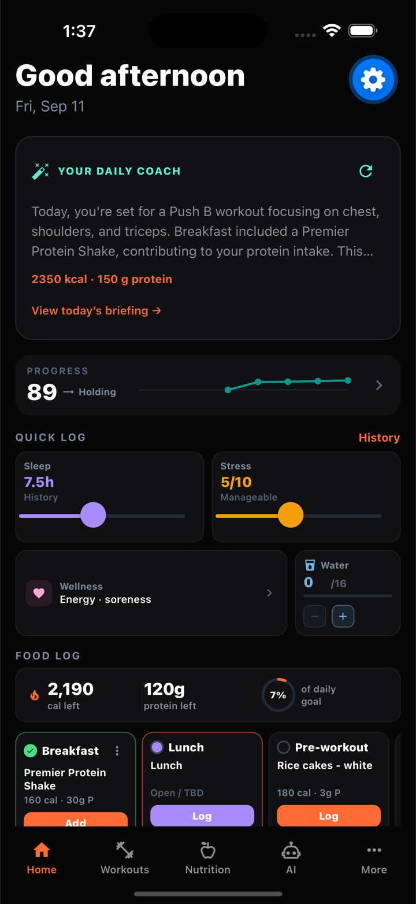
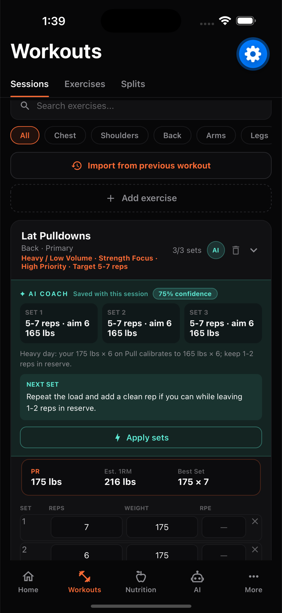
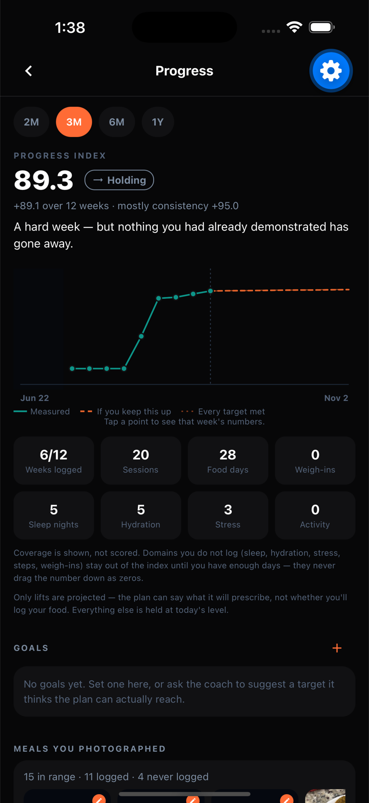
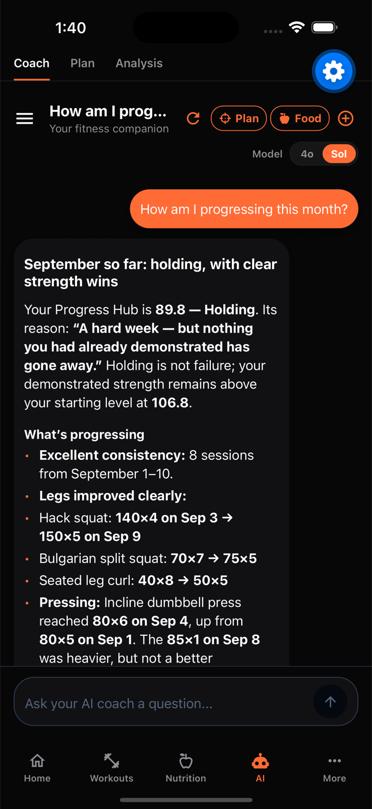
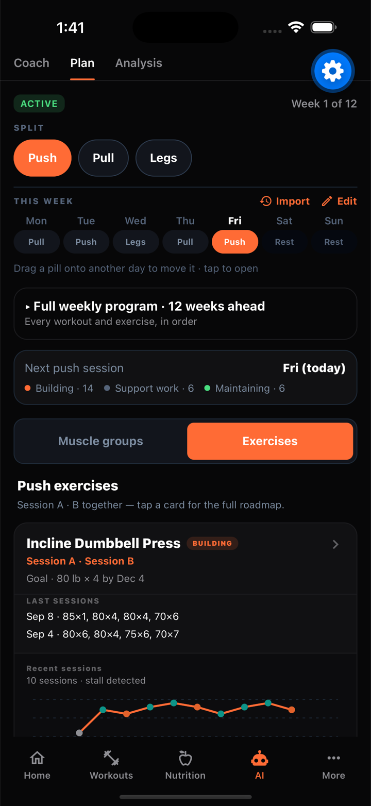
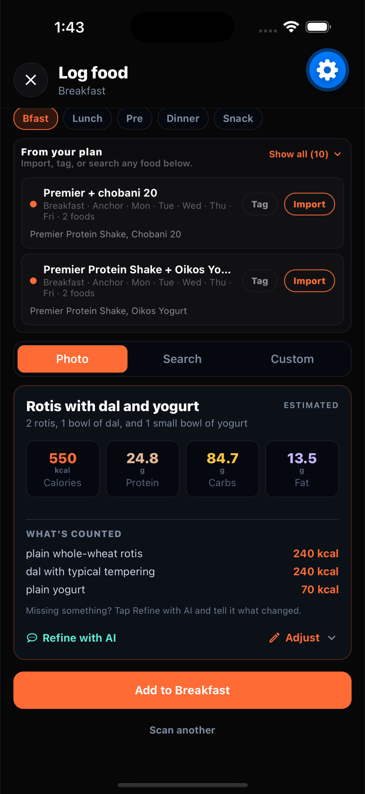
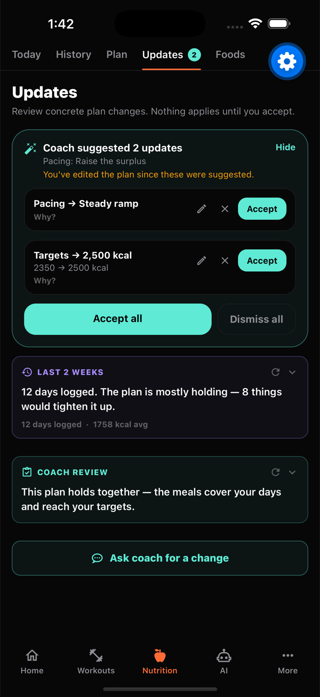

# GymAI

**An AI training partner that decides what you lift today, what you eat today, and shows you where that leads.**

Log workouts, nutrition, sleep and recovery — GymAI turns that history into a concrete
prescription for the next session, a goal-fit reading of every meal, and a week-by-week
projection of where the plan is going.

**[Try the live prototype →](https://gym-ai-agent-five.vercel.app/dashboard)**

---

## The app

<table>
  <tr>
    <td width="25%"></td>
    <td width="25%"></td>
    <td width="25%"></td>
    <td width="25%"></td>
  </tr>
  <tr>
    <td align="center"><b>Home</b><br/>One screen for the day</td>
    <td align="center"><b>Today's sets</b><br/>A rep band, and what to do if you miss</td>
    <td align="center"><b>Progress</b><br/>What you've demonstrated, and where it's going</td>
    <td align="center"><b>AI Coach</b><br/>Reads the same numbers the screens do</td>
  </tr>
</table>

<table>
  <tr>
    <td width="25%"></td>
    <td width="25%"></td>
    <td width="25%"></td>
    <td width="25%"></td>
  </tr>
  <tr>
    <td align="center"><b>Plan Hub</b><br/>Drag a day, see 12 weeks ahead</td>
    <td align="center"><b>Logging food</b><br/>Every estimate shows its ledger</td>
    <td align="center"><b>Nutrition plan</b><br/>Built around what you actually eat</td>
    <td align="center"><b>Coach updates</b><br/>Suggestions you accept</td>
  </tr>
</table>

> iPhone 16 Pro Max · iOS 18.6, September 2026, on a real account. The **coach** shot is a
> live answer: it called `get_progress_index` and `get_exercise_history`, quoted the hub's
> own reason string back, and cited logged sets by date. The **plan updates** shot shows
> the staged-suggestion model — *nothing here changes your plan until you accept it.*

---

## The core idea

Most fitness apps hand an LLM your data and ask it for a number. That produces a
confident answer that changes every time you ask, and quietly drifts from your history.

GymAI splits the problem in two:

| | Who decides | Why |
|---|---|---|
| **Numbers** — weight, reps, calories, ramps, scores | Deterministic Python | Reproducible, testable, and identical whether or not the model is up |
| **Intent & prose** — plan structure, explanations, coaching | LLM (GPT-4o / GPT-5.6 Sol) | Language and judgment, where variance is fine |

If OpenAI is down, GymAI still tells you exactly what to lift. You just get a template
sentence instead of a written one.

Three rules fall out of that split, and most of the design follows from them:

1. **Two lines, never one.** Anything projected forward ships a best case *and* a
   realistic case. A single confident line reads well on day one and tells you you're
   failing by week five when you're training normally.
2. **100 is you.** Every index is anchored on the user's own baseline or their own plan's
   expectation — never a population norm. A cut and a bulk must both be able to score 100.
3. **Refuse rather than guess.** No plan targets → no fit score. Too few weigh-ins → no
   body trend. Not enough weeks → `on_track` is null and the UI says "too early". A
   fabricated baseline produces a confident deviation, and confident deviations are
   exactly what the engine acts on.

---

## AI architecture

```
                 ┌──────────────────────────────────────────────┐
   raw logs      │  Layer 1 — Daily rollup                      │
 workouts        │  metrics/baseline.py, state/daily_rollup.py  │
 nutrition  ───► │  every signal → {value, target, deviation,   │
 sleep           │   confidence, status}, one doc per day       │
 wellness        └───────────────────┬──────────────────────────┘
                                     │
                 ┌───────────────────▼──────────────────────────┐
                 │  Layer 2 — Metric registry                   │
                 │  metrics/registry.py                         │
                 │  polarity (is high good?) + actionability    │
                 │  (can you fix it today?)                     │
                 └───────────────────┬──────────────────────────┘
                                     │
                 ┌───────────────────▼──────────────────────────┐
                 │  Layer 3 — Shared read model                 │
                 │  state/user_state.py                         │
                 │  readiness (scalar) + next_levers (ranked)   │
                 └────────┬─────────────────────────┬───────────┘
                          │                         │
            ┌─────────────▼──────────┐   ┌──────────▼─────────────┐
            │  ProgressionEngine     │   │  Narrative surfaces    │
            │  pure Python, no LLM   │   │  coach chat, progress, │
            │  → every weight & rep  │   │  roadmap, home, plans  │
            └─────────────┬──────────┘   └──────────┬─────────────┘
                          │                         │
                 ┌────────▼──────────┐    ┌─────────▼───────────┐
                 │ ReasoningGenerator│    │ LLM + function-call │
                 │ LLM explains the  │    │ toolbox (read-only  │
                 │ number, or a      │    │ by default)         │
                 │ template does     │    └─────────────────────┘
                 └───────────────────┘
```

**One read model, many surfaces.** Home, the coach, the Progress tab and the plan all
argue for the same priority because they read the same ranked `next_levers` list and the
same builders, instead of each inventing its own from a prompt. The coach's progress
tools call the exact functions the Progress tab renders — recomputing them in the toolbox
with different rules is how an app tells you one thing in a chart and another in chat.

### The progression engine (`backend/ai_analysis/workout_recommender/`)

Pure Python double progression. Given your history and goal, it computes the exact
weight and reps for your next set.

- **A prescription is a rep band plus a branch**, not a single number. Two strategies:
  `BAND` (one load, fill a rep range) and `TOP_SET` (one heavy set, backoffs, and an
  explicit "if you miss, drop to X").
- **Sessions are judged against their band, never by total volume.** Volume comparison
  scored a successful weight increase as a failure — 50×10×3 → 55×6×3 is *less* volume —
  which rolled users back and oscillated forever. Judgment is anchored on the median set,
  so reliably dropping one rep doesn't strand you.
- **Every prescription must be able to move.** Three dead ends produced a card that could
  never change, all now pinned in `tests/test_progression_dead_ends.py`: bodyweight
  history was deleted before the engine saw it (a pull-up has no `weight > 0`); the rep
  step clamped to the top of the band, answering an 11-rep set with 10; and a hold
  re-served the exact session that had just failed, guaranteeing another miss forever.
  A miss three or more reps under the floor now means the *load* is what the band can't
  survive, and the load comes down.
- **Est. 1RM is computed within one set.** Pairing a heavy set's load with a light set's
  reps reported a 1RM the user had never been near — a 150 lb PR plus a 10-rep set became
  "200 lbs" when the best set of 135×8 gives 171. The card shows the figure *and* names
  the set it came from, or shows nothing when no set qualifies.
- **Readiness can only hold you back, never push you forward.** Sleep/fatigue resolve to
  a scalar that gates the recommendation down. Every failure path returns neutral: stale
  or missing data leaves recommendations byte-identical to no readiness at all.

### Progress Hub (`backend/progress/`)

A stock-profile view of training: one weekly index, eight domains under it, your lifts as
positions, and the meals you photographed. The hard part isn't the chart, it's that
**a bad week is three different things that look identical on one**: no evidence (nothing
logged), expected low (a deload the plan asked for), and real decline. Only the third is
information, so only the third may move a level.

- **Level vs. trend.** `level` is what you've *demonstrated* — peak-anchored, so a bad
  week is structurally incapable of lowering it. `current` is the fast signal, and the
  state machine has to see it, or a hard week is invisible and reads as "stalled — worth
  changing something" when you simply had a rough week.
- **The noise band** is the mean absolute deviation of weekly deltas *around their mean*,
  not around zero. Scored against zero, a user climbing a steady half point a week
  inflates the band by exactly the trend you're looking for.
- **Coverage is reported, never scored.** If missing logs lowered the number it would
  measure app engagement, not training; if they cost nothing, the way to a perfect score
  is to stop logging. So it's its own stat row, outside the math.
- **Only strength is projected forward.** Consistency, nutrition and body are carried
  flat and labelled as held — the plan can say what it will prescribe, it cannot say
  whether you'll log your food. The honest, modest slope is the point.
- **Goals store the value they started from**, stamped at creation and never recomputed.
  Without it, progress can only be a fraction of the target, which reads as 92% done the
  moment someone with a 415 squat sets a 450 goal.

`FORMULA_VERSION` is stamped on every point: changing the weights is a new version, not
an edit, because recomputing history would silently rewrite your past.

### The AI coach (`backend/ai_analysis/ai_coach.py`, `coach_tools.py`)

Chat with function calling over your real records — **18 read tools**
(`get_exercise_history`, `get_progress_index`, `get_lift_positions`, `get_today_remaining`,
`get_personal_records`, `get_latest_body_scan`, …) so the model pulls what it needs
instead of us guessing what to stuff in the prompt. Bounded tool loops, streaming,
persisted conversations, and safety rails that keep it out of diagnosis.

Every tool schema carries the **reading rules** its numbers need: 100 is your own
baseline, `holding` is not a warning, low coverage is thin logging rather than poor
training, and a null `on_track` must be reported as such.

Writes are staged, never applied. `propose_plan_edits`, `propose_nutrition_edits` and
`propose_progress_goal` all produce suggestions you accept — a goal you never agreed to
is one you'd be measured against without choosing it.

**Looking at a meal photo is opt-in.** Reading back what you logged answers a question
about your diet; opening the photograph is looking at a picture of you and your table.
So `view_meal_photo`'s schema is *omitted entirely* unless your current message asks to
see it — a prompt instruction is advisory and a model that ignores it still gets to make
the call; a tool that was never offered cannot be called at all. Body-scan photos are
never retained and so are never in scope.

### Plan generation & projection

- **Generation** (`plan_generator.py`, `plan_builder.py`) — the LLM picks structure and
  intent from an equipment-filtered catalog; output is validated against a strict schema
  before it's shown. It never picks weights.
- **Projection** (`plan_projection.py`, `progress/projection.py`) — runs the *real*
  progression engine forward week by week, seeded from your history. Not a curve fitted
  to look encouraging: literally what the app will ask of you. Always **two lines** —
  `best_case` (every target hit) and `realistic` (the same curve stretched by your
  measured adherence).
- **Nutrition ramps** (`nutrition/trajectory.py`, `pacing.py`) — calories move week by
  week, because maintenance rises as bodyweight does. Deficits never ramp deeper; the
  answer to a stalled cut is a diet break. Bodyweight curves refuse to run without a
  complete profile rather than guessing.

Gains are reported from **peak** e1RM, never the final week: e1RM genuinely dips on the
session a weight jump lands, so reading the last week reports a loss whenever the horizon
ends on a reset.

### Food logging (`backend/nutrition/`)

Photo → estimate → correct → log, with a written description as a first-class path.

- **Cheap-first routing.** A cheap model runs first and is asked to show its work — a
  component ledger, a portion range, and calories that reconcile against both. The photo
  re-runs on the strong model when that work is internally inconsistent. Escalation is
  deliberately **not** driven by the confidence score: that score grades photo
  legibility, which is a different thing from accuracy. A sharp, well-lit tray scores
  "medium" and can still be 30% low; a blurry photo scores "low" and is the case a
  stronger model helps with least.
- **The prompt is versioned, and v3 enumerates before it estimates.** v1 and v2 tune how
  *big* an estimate is; neither can catch a component that was never estimated at all.
  Khichdi photographed with a katori of dahi came back as khichdi and every guard passed
  it — because every guard tests for *inconsistency*, and an omission is perfectly
  consistent. v3 lists every edible thing in the frame first; anything enumerated and
  left out has to be named, and shows on the card as "Not counted: …".
- **Every macro reconciles with the ledger, not just calories.** A ledger reading 41 g of
  protein under a stated 25 g logged 25 — and rendered the disagreeing ledger directly
  underneath the number. Protein is the macro users track most closely and the one a
  forgotten side of dahi costs the most.
- **Corrections carry the photo.** The upload is deleted after the first estimate, so
  "Refine with AI" reloads the archived copy and re-attaches it. When it genuinely can't
  — the meal was typed, the archive dropped the image, the read failed — the chat *says
  so* and the model is explicitly forbidden from claiming it looked. Silence was the bug:
  four paths reached the chat without the photo and every one of them narrated a plate it
  had never been sent.
- **A typed meal gets the same treatment as a photographed one.** It used to run a single
  hardcoded `gpt-4o-mini` call with no ledger, no confidence and no escalation.
  `text_estimate.py` grades a sentence on whether the *amount* was stated, not on whether
  the food can be seen — "some rice" and "180 g of rice, boiled" are equally legible
  strings and nothing like equally estimable.
- **Your own calorie figure is evidence, never a floor.** `parse_calorie_hint` decides
  deterministically whether "about 600" describes the whole meal or one part, and states
  that reading in the prompt — a model that has already mis-scoped the number will report
  the mis-scoped reading back. With no rule for the whole-meal case, the model stacked
  filling and oil on top of it, and a 600 kcal guess came back as 1100.
- **Fit score, not health score.** `fit_score.py` scores *goal fit*: the same kadhi is a
  good fit on a lean bulk and a poor one on a cut. Deterministic, scored against the meal
  slot rather than the running day, `None` without plan targets, and `trivial` under
  40 kcal so a smear of ketchup doesn't read as a dietary failure.

`users/{uid}/food_photo_logs` archives the image, the estimate, the correction chat and —
via the accepted-macros endpoint — what you actually committed. That last field is the
only real label, and `replay_photo_estimates.py` scores a prompt or model change against
it. The archive was untracked in git until September 2026, so it only starts accumulating
now; **v3 is the default on argument, not evidence**, the same footing v2 had.

### Meal timing

A logged food used to carry a slot and no clock. It now carries `logged_at` (server
stamped), `eaten_at` (your own statement, which wins), and the slot the app chose versus
the one you moved it to. **A log time is only evidence when it lands on the day being
logged** — filling in yesterday's dinner at 11pm tonight would otherwise report an 11pm
dinner and drag every average with it. `GET /api/macros/meal-timing` returns per-slot
habits, daily eating windows, and the moves you keep making — which is the app filing a
food wrong, not you changing your mind.

### Body scans: observations, never photos

Qualitative observations only — no fabricated body-fat percentages. `photos_retained` is
written `False` and the router clears the upload the moment the vision pass returns. A
deterministic synthesizer turns observations into training emphasis deltas; the LLM only
explains why afterward. Scan-to-scan comparison reads development as ordinal *upward* and
posture as ordinal *downward*, because one shared ordering would report a worsening
slouch as progress.

### Charts

Marks use dedicated series colors, not the UI accents — the brand teal/orange sit above
the lightness band that reads as a data mark on a dark surface. The domain hues were
found by sweeping the hue wheel at fixed lightness and chroma and validating every pair
for CVD separation; the worst pair sits in the 6–8 ΔE band, which is legal **only**
because no two of them ever share a plot frame. No dual-axis charts: calories and
bodyweight get separate frames.

---

## Key features

| | |
|---|---|
| **Today's workout** | Dashboard card → one tap to a pre-populated session with per-exercise prescriptions |
| **AI recommendations** | Per-exercise sets, a rep band, a load and a miss-branch, from your history, goal, plan intent and readiness |
| **Plan generator** | 3-step wizard (goals, schedule, equipment) → a structured program, solving the cold start |
| **Plan Hub** | Drag a day to move it, expand the full 12-week program, per-lift building / supporting / maintaining status |
| **Plan roadmap** | Strength + bodyweight projections on one week axis, best-case vs. realistic |
| **Progress Hub** | Weekly index, eight domains, lifts as positions, goals, and your meal-photo archive |
| **Nutrition plans** | Questionnaire → targets, meal anchors and slot strategy, with week-by-week pacing and check-ins |
| **Today guidance** | What's left to eat right now, given what you've logged and which meals are still flexible |
| **Food logging** | Photo, description, search, or "usuals" — component ledger, goal-fit score, and a correction chat that keeps the photo |
| **Meal timing** | Per-slot clock habits, eating windows, and the mis-filings you keep correcting |
| **Body scan** | Guided photos → asymmetry/emphasis observations you can apply to your plan. Images are never stored |
| **AI coach chat** | Streaming chat grounded in your records, with coach / plan / nutrition modes and staged writes |
| **Wellness & recovery** | Sleep, hydration, stress, fatigue, body feelings — feeding readiness |
| **Records & analysis** | All-time maxes, est. 1RM traced to the set it came from, monthly AI reviews, calendar |

---

## Tech stack

| Layer | Stack |
|---|---|
| **Mobile** | React Native 0.86 · Expo SDK 57 · React Navigation (the primary UI) |
| **Web** | React 18 · TypeScript · Vite · Tailwind · Firebase Auth |
| **Backend** | FastAPI · Python · Firestore · Pydantic |
| **AI** | OpenAI GPT-4o / GPT-5.6 Sol (function calling, vision, streaming) · USDA FoodData Central |

```
gymaiAgent/
├── frontend/                 # React Native / Expo app  (primary)
├── web-app/                  # React web app
└── backend/
    ├── ai_analysis/          # coach, toolbox, plan generation, projection
    │   └── workout_recommender/   # the deterministic progression engine
    ├── nutrition/            # plans, pacing, trajectory, vision, text estimates, USDA
    ├── progress/             # weekly index, domains, goals, photo archive
    ├── metrics/ + state/     # baselines, registry, shared read model
    ├── body_scan/            # vision + deterministic synthesis
    └── routers/              # 24 FastAPI routers
```

---

## Setup

### Backend

```bash
cd backend
pip install -r requirements.txt
```

Add `firebase-service-account.json` to `backend/`, set `OPENAI_API_KEY` in `.env`
(see `.env.example`), then:

```bash
python main.py          # http://localhost:8000
```

### Mobile app

```bash
cd frontend
npm install
npx expo start          # press i for the iOS simulator
```

### Web app

```bash
cd web-app
npm install
npm run dev             # http://localhost:5173
```

Create `.env` with your Firebase config and point `VITE_API_BASE_URL` at the backend.

### Tests

```bash
cd backend
pytest                  # progression, prescription, projection, nutrition, progress, state
```

The engine's behavior is pinned by tests, and the interesting ones are regression tests
for bugs that shipped: the volume-oscillation bug and the flawless-sweep bug in
`tests/test_prescription.py`, the three unmovable prescriptions in
`tests/test_progression_dead_ends.py`, the silently-dropped side dish in
`tests/test_nutrition_uncounted_items.py`, and the hard week that read as a stall in
`TestABadWeekReachesTheClassifier`.
