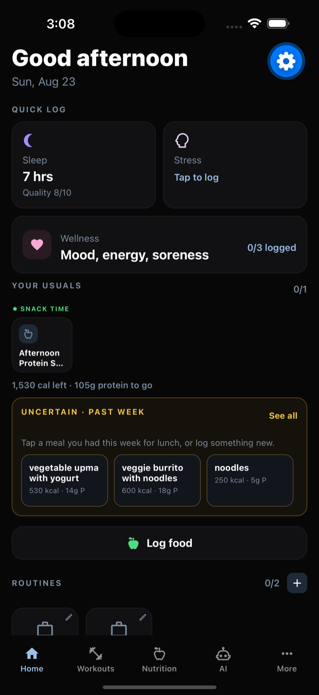
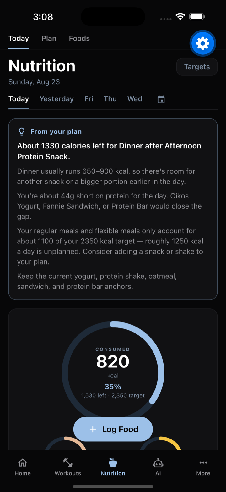
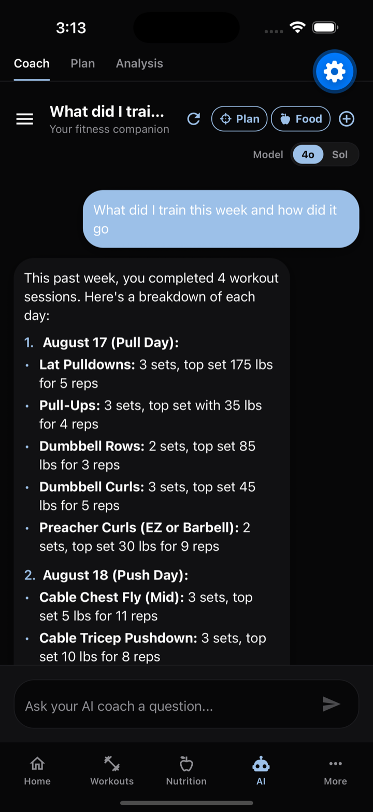
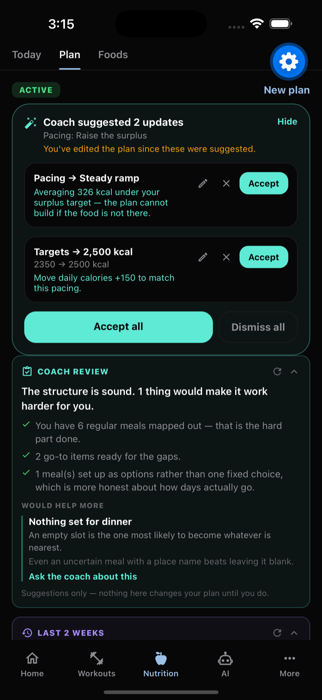
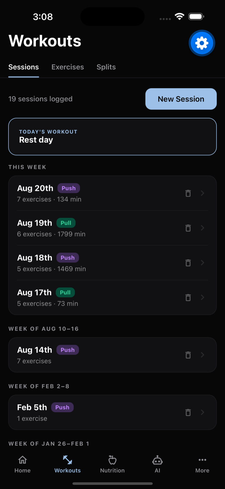
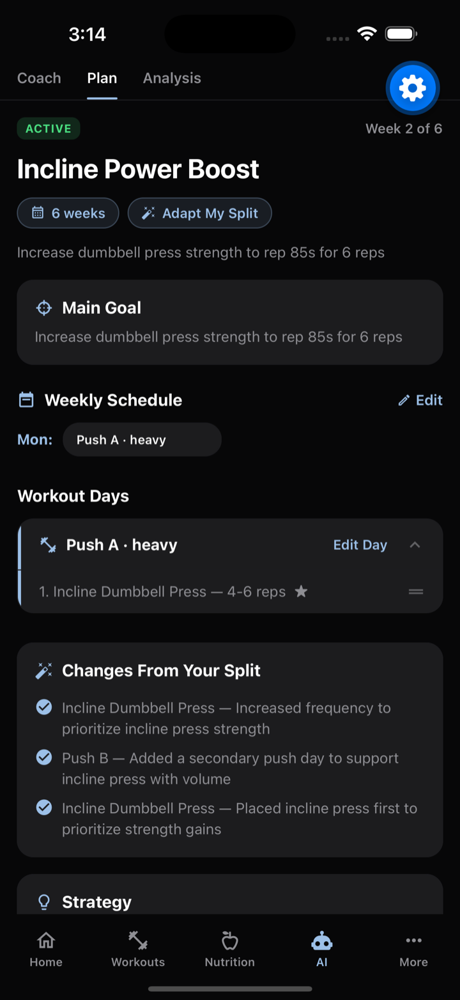
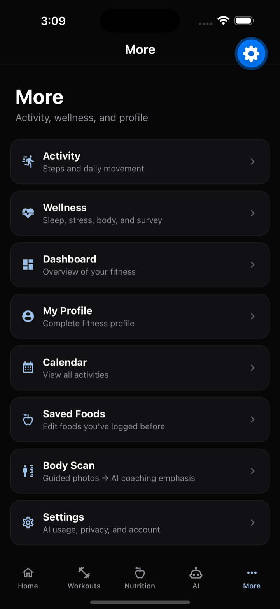
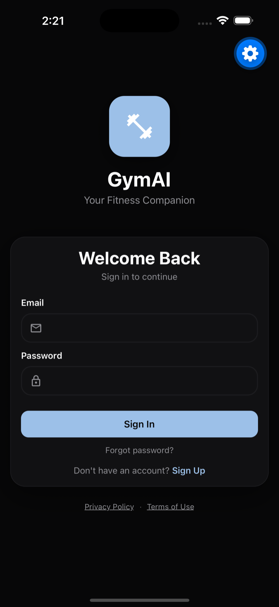

# GymAI

**An AI training partner that decides what you lift today, what you eat today, and shows you where that leads.**

Log workouts, nutrition, sleep and recovery — GymAI turns that history into a concrete
prescription for the next session and a week-by-week projection of where the plan is going.

**[Try the live prototype →](https://gym-ai-agent-five.vercel.app/dashboard)**

---

## The app

<table>
  <tr>
    <td width="25%"></td>
    <td width="25%"></td>
    <td width="25%"></td>
    <td width="25%"></td>
  </tr>
  <tr>
    <td align="center"><b>Home</b><br/>One screen for the day</td>
    <td align="center"><b>Today</b><br/>What's left to eat, and when</td>
    <td align="center"><b>AI Coach</b><br/>Answers from your actual sets</td>
    <td align="center"><b>Nutrition plan</b><br/>Suggestions you accept</td>
  </tr>
</table>

<table>
  <tr>
    <td width="25%"></td>
    <td width="25%"></td>
    <td width="25%"></td>
    <td width="25%"></td>
  </tr>
  <tr>
    <td align="center"><b>Workouts</b><br/>Sessions, exercises, splits</td>
    <td align="center"><b>Active plan</b><br/>And what it changed, and why</td>
    <td align="center"><b>Everything else</b><br/>Wellness, body scan, calendar</td>
    <td align="center"><b>Sign in</b><br/>Firebase Auth</td>
  </tr>
</table>

> iPhone 16 Pro Max · iOS 18.6. The **AI Coach** shot is a live answer — the model called
> `get_recent_sessions` and read back real logged weights. The **nutrition plan** shot shows
> the staged-suggestion model: *nothing here changes your plan until you accept it.*

---

## The core idea

Most fitness apps hand an LLM your data and ask it for a number. That produces a
confident answer that changes every time you ask, and quietly drifts from your history.

GymAI splits the problem in two:

| | Who decides | Why |
|---|---|---|
| **Numbers** — weight, reps, calories, ramps | Deterministic Python | Reproducible, testable, and identical whether or not the model is up |
| **Intent & prose** — plan structure, explanations, coaching | LLM (GPT-4o / GPT-5.6) | Language and judgment, where variance is fine |

If OpenAI is down, GymAI still tells you exactly what to lift. You just get a template
sentence instead of a written one.

---

## AI architecture

```
                 ┌──────────────────────────────────────────────┐
   raw logs      │  Layer 1 — Daily rollup                      │
 workouts        │  metrics/baseline.py, state/daily_rollup.py  │
 nutrition  ───► │  every signal → {value, target, deviation,   │
 sleep           │   confidence, status}, one doc per day       │
 wellness        └───────────────────┬──────────────────────────┘
                                     │
                 ┌───────────────────▼──────────────────────────┐
                 │  Layer 2 — Metric registry                   │
                 │  metrics/registry.py                         │
                 │  polarity (is high good?) + actionability    │
                 │  (can you fix it today?)                     │
                 └───────────────────┬──────────────────────────┘
                                     │
                 ┌───────────────────▼──────────────────────────┐
                 │  Layer 3 — Shared read model                 │
                 │  state/user_state.py                         │
                 │  readiness (scalar) + next_levers (ranked)   │
                 └────────┬─────────────────────────┬───────────┘
                          │                         │
            ┌─────────────▼──────────┐   ┌──────────▼─────────────┐
            │  ProgressionEngine     │   │  Narrative surfaces    │
            │  pure Python, no LLM   │   │  coach chat, roadmap,  │
            │  → every weight & rep  │   │  dashboard, plans      │
            └─────────────┬──────────┘   └──────────┬─────────────┘
                          │                         │
                 ┌────────▼──────────┐    ┌─────────▼───────────┐
                 │ ReasoningGenerator│    │ LLM + function-call │
                 │ LLM explains the  │    │ toolbox (read-only  │
                 │ number, or a      │    │ by default)         │
                 │ template does     │    └─────────────────────┘
                 └───────────────────┘
```

**One read model, many surfaces.** Home, the coach and the plan all argue for the same
priority because they read the same ranked `next_levers` list, instead of each inventing
its own from a prompt.

### The progression engine (`backend/ai_analysis/workout_recommender/`)

Pure Python double progression. Given your history and goal, it computes the exact
weight and reps for your next set.

- **A prescription is a rep band plus a branch**, not a single number. Two strategies:
  `BAND` (one load, fill a rep range) and `TOP_SET` (one heavy set, backoffs, and an
  explicit "if you miss, drop to X").
- **Sessions are judged against their band, never by total volume.** Volume comparison
  scored a successful weight increase as a failure — 50×10×3 → 55×6×3 is *less* volume —
  which rolled users back and oscillated forever. Judgment is anchored on the median set,
  so reliably dropping one rep doesn't strand you.
- **Readiness can only hold you back, never push you forward.** Sleep/fatigue resolve to
  a scalar that gates the recommendation down. Every failure path returns neutral: stale
  or missing data leaves recommendations byte-identical to no readiness at all.
- **Baselines cancel out rather than guess.** Below a minimum sample count a metric
  reports `insufficient_data` and contributes nothing. A fabricated target produces a
  confident deviation, and confident deviations are exactly what the engine acts on.

### The AI coach (`backend/ai_analysis/ai_coach.py`)

Chat with function calling over your real records — 12 read tools (`get_exercise_history`,
`get_today_remaining`, `get_personal_records`, `get_latest_body_scan`, …) so the model
pulls what it needs instead of us guessing what to stuff in the prompt. Bounded tool
loops, streaming responses, persisted conversations, and safety rails that keep it out of
diagnosis. Write access is scoped: only nutrition mode can *stage* plan edits, and edits
land as suggestions you accept — nothing rewrites a live plan on its own.

### Plan generation & projection

- **Generation** (`plan_generator.py`, `plan_builder.py`) — the LLM picks structure and
  intent from an equipment-filtered catalog; output is validated against a strict schema
  before it's shown. It never picks weights.
- **Projection** (`plan_projection.py`) — runs the *real* progression engine forward week
  by week, seeded from your history. Not a curve fitted to look encouraging: literally
  what the app will ask of you. Always **two lines** — `best_case` (every target hit) and
  `realistic` (the same curve stretched by your measured adherence). One confident line
  is the failure mode this avoids.
- **Nutrition ramps** (`nutrition/trajectory.py`, `pacing.py`) — calories move week by
  week, because maintenance rises as bodyweight does. Deficits never ramp deeper; the
  answer to a stalled cut is a diet break. Bodyweight curves refuse to run without a
  complete profile rather than guessing.

### Vision

- **Meal photos** — YOLOv8 detection → USDA FoodData Central lookup → GPT-4o vision
  fallback for anything USDA can't match.
- **Body scans** — qualitative observations only (no fabricated body-fat percentages),
  images held in memory and never stored. A deterministic synthesizer turns observations
  into training emphasis deltas; the LLM only explains why afterward.

---

## Key features

| | |
|---|---|
| **Today's workout** | Dashboard card → one tap to a pre-populated session with per-exercise weight/rep prescriptions |
| **AI recommendations** | Per-exercise sets, reps, weight and a rep band, from your history, goal, plan intent and readiness |
| **Plan generator** | 3-step wizard (goals, schedule, equipment) → a structured program, solving the cold start |
| **Plan roadmap** | Strength + bodyweight projections on one week axis, best-case vs. realistic |
| **Nutrition plans** | Questionnaire → targets, meal anchors and slot strategy, with week-by-week pacing and check-ins |
| **Today guidance** | What's left to eat right now, given what you've logged and which meals are still flexible |
| **Food logging** | Photo, search, or "usuals" — USDA-backed macros with AI fallback |
| **Body scan** | Progress photos → asymmetry/emphasis observations you can apply to your plan |
| **AI coach chat** | Streaming chat grounded in your actual records, with coach / plan / nutrition modes |
| **Wellness & recovery** | Sleep, hydration, stress, fatigue, body feelings — feeding readiness |
| **Records & analysis** | All-time maxes, estimated 1RM, monthly AI reviews, calendar |

---

## Tech stack

| Layer | Stack |
|---|---|
| **Web** | React 18 · TypeScript · Vite · Tailwind · Firebase Auth |
| **Mobile** | React Native 0.86 · Expo SDK 57 |
| **Backend** | FastAPI · Python · Firestore · Pydantic |
| **AI** | OpenAI GPT-4o / GPT-5.6 (function calling, vision, streaming) · YOLOv8 · USDA FoodData Central |

```
gymaiAgent/
├── web-app/                  # React web app (main UI)
├── frontend/                 # React Native / Expo app
└── backend/
    ├── ai_analysis/          # coach, plan generation, projection
    │   └── workout_recommender/   # the deterministic progression engine
    ├── nutrition/            # plans, pacing, trajectory, vision, USDA
    ├── metrics/ + state/     # baselines, registry, shared read model
    ├── body_scan/            # vision + deterministic synthesis
    └── routers/              # 21 FastAPI routers
```

---

## Setup

### Backend

```bash
cd backend
pip install -r requirements.txt
```

Add `firebase-service-account.json` to `backend/`, set `OPENAI_API_KEY` in `.env`
(see `.env.example`), then:

```bash
python main.py          # http://localhost:8000
```

### Web app

```bash
cd web-app
npm install
npm run dev             # http://localhost:5173
```

Create `.env` with your Firebase config and point `VITE_API_BASE_URL` at the backend.

### Tests

```bash
cd backend
pytest                  # progression, prescription, projection, nutrition, state layer
```

The engine's behavior is pinned by tests — the volume-oscillation bug and the
flawless-sweep bug both have regression tests in `tests/test_prescription.py`.
